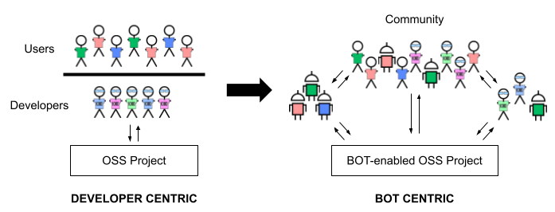

<!--

Please note that by submitting a PR with a new proposal, you agree to release this proposal text under the Creative Commons Zero v1.0 Universal license. See https://github.com/PlaintextGroup/oss-virtual-incubator/blob/main/LICENSE.

If you'd like to submit a proposal yourself, you have two options:

1. Fork this repo and make a copy of [PROPOSAL-TEMPLATE.md](PROPOSAL-TEMPLATE.md). Write up your proposal in the `proposals` directory, then [make a pull request](https://github.com/PlaintextGroup/oss-virtual-incubator/pulls) to this repository.
2. If you'd rather just use a form, [fill out this form][form]. Unless you tell us otherwise, we will copy over your proposal to this GitHub repository.

-->

### Title

<!-- A short, pithy title for the proposal. -->

Community Bots for Open Source Software

### Short description

<!-- A short, one-sentence description of the proposal. -->

We want to explore whether providing Open Source Software (OSS) projects with free and fully available on-demand help in the form of swarms of (smart) bots could be the scalable solution OSS needs to address long-term sustainability issues.

### Author(s)

<!-- Put your GitHub username(s) here. The proposal author(s) will "own" the proposal and will be able to accept future PRs that change it. -->

[@jlcanovas](https://github.com/jlcanovas)
[@jcabot](https://github.com/jcabot)

### Proposal body

<!-- Explain your proposal. Add as much as you want, within reason! -->

Transforming Open Source Software (OSS) engineering into a successful and sustainable process, able to provide the foundations on top of which build up the digital transition of our society, requires being able to enroll as much additional help as possible to manage the software and the surrounding community. 

But hiring more programmers or onboarding more contributors is not a practical solution given the large number of projects to fund, the shortage of professional programmers and the well-known challenges of onboarding new members into an ongoing project. Instead, we advocate for hiring help for free and fully available on-demand in the form of swarms of smart bots as the only scalable solution. Therefore, the main objective of this proposal can be stated as: _Building, One Bot at a Time, a Unified Framework for Sustainable Software Development Communities_.

This proposal represents a shift in the way Open Source software is developed and maintained by proposing the use of a swarm of smart software bots to assist project owners and developers but also occasional contributors and community members in their software-related tasks. 

The following figure illustrates this change of perspective, highlighting how we go from the current developer-centric view to a fully open environment where different types of bots (and coordinated swarms of bots) interact with all kinds of member profiles to advance the project in a way that satisfies the goals of the community as a whole.

Examples of such tasks would go all the way up from simple duties like welcoming new project members or helping them to write useful bug reports, to complex ones like automatically reject/fix contributions that violate the project guidelines or code of conduct. In particular, we want to focus on bots covering the more social aspects as we believe keeping healthy communities should be a top priority in any Open Source project. 

As such, we propose to concentrate on a set of software bots to monitor and nurture healthy OSS project communities. Some dimensions we foresee these bots may address are (but not limited to):

 * Helping newcomers to feel welcome in the project
 * Detecting toxic comments and toxic behavior
 * Promoting a diverse and inclusive community, e.g., making sure minority voices are heard.
 * Checking violations of the code of conduct.
 * Analyzing the sentiment of the community for early detection of community problems.

To achieve these goals, bots will need to be smart. We propose to benefit from the advances in Natural Language Processing to train the bots. As an example, pretrained toxicity models would be used for bots monitoring toxic behavior while multilingual models could be used for automatic translation offering a more inclusive environment.

### Due diligence

<!-- Please answer the following due diligence questions; it's okay to answer "N/A" if you don't know yet. -->

1. **What related work has already been done in this area?** <!-- Insert answer here --> 

   The idea of bots helping in software development has been explored in several works (e.g., [Storey et al. 2016](https://dl.acm.org/doi/10.1145/2950290.2983989), [Erlenhov et al. 2018](https://ieeexplore.ieee.org/document/8823643), [Erlenhov et al. 2020](https://dl.acm.org/doi/10.1145/3368089.3409680)), which explore their key role in addressing specific development tasks. Similarly, a couple of bots targeting Open Source development have also been proposed, such as bots for detecting unmaintained projects ([Coelho et al. 2020](https://linkinghub.elsevier.com/retrieve/pii/S0950584920300240)) or predicting whether newcomers may become long-term contributors ([Bao et al. 2021](https://ieeexplore.ieee.org/document/8721092)). A list of other simple bots, mostly by individual developers, can be found [here](https://livablesoftware.com/best-bots-software-development/).

2. **How is this proposal innovative -- what distinguishes it from other related work?** <!-- -->

   The results of this proposal will expand the current state of the art related to Open Source analysis, machine learning, and bot development and attempt a radically new solution to the Open Source sustainability problem. To the best of our knowledge, none of the existing solutions address the specific concern of sustaining healthy OSS communities by providing a swarm of bots to perform detection, reporting and enforcing community actions. Furthermore, our proposal goes beyond the framework and tasks to build such smart bots and emphasizes as well the need to deploy such bots in real projects and measure their impact as a way to learn how people want to interact with the bots and how we can optimize the human-bot (and even bot-to-bot) collaboration.

3. **Who is your doer -- who will execute the proposed work?** <!-- Insert answer here -->

   The work will be developed in the context of our research team, called [SOM Research Lab](https://som-research.uoc.edu/) and led by [Jordi Cabot](https://jordicabot.com/) at the [Open University of Catalonia](https://www.uoc.edu/portal/en/index.html). In terms of expertise, the team has experience, first, in the field of software engineering, especially using model-based techniques that could help to develop bots in a platform-agnostic way; second, in the field of Open Source Analysis, in particular, the study on community dynamics and governance models; and finally, in the creation of smart bots thanks to our [Open Source (chat)bot builder](https://github.com/xatkit-bot-platform).

4. **How might this work be sustained long-term after an initial seed grant?** <!-- Insert answer here -->

   This initial grant would allow us to develop a proof-of-concept ambitious enough to demonstrate our idea. If successful, we plan to follow-up the work via a combination of additional national/european research grants, tech transfer contracts to develop / adapt specific bots to interested projects and via (sponsored) volunteer work from Open Source contributors that see the potential of this idea and their possible future impact on the Open Source world.

### Resources needed

<!-- What resources are needed (grant money, advisors, expertise, etc.) to realize this proposal? -->

We request funding to hire a research engineer to develop a proof of concept consisting in the (1) development of the project infrastructure and a few community bots, (2) their integration in a selected sample of Open Source projects, (3) the measurement of their impact in such projects, and (4) writing the report and dissemination posts/articles to present the idea to other potentially interested projects and bot developers. 

### Other links and resources

<!-- Add any other links, images, or resources that are relevant to the proposal -->
