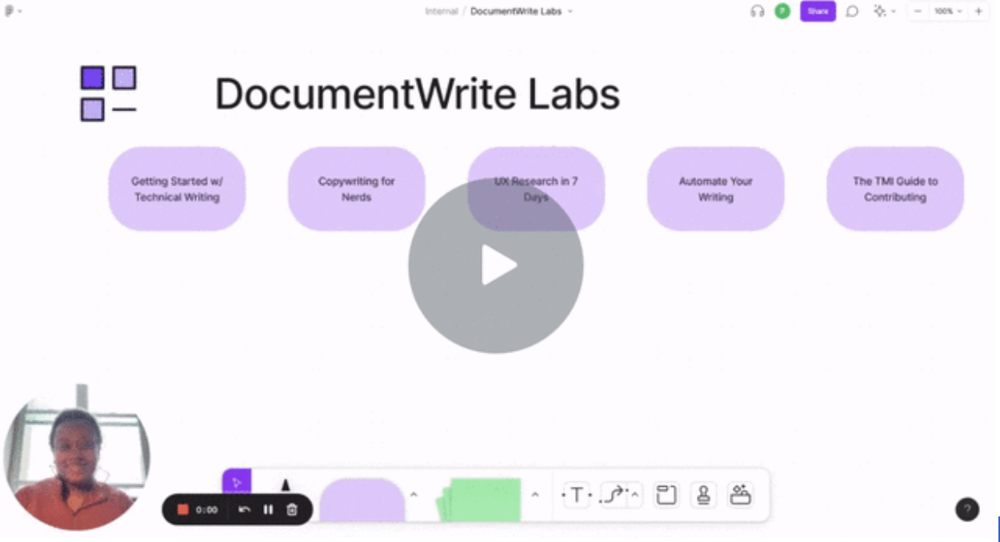

### Title

DocumentWrite Labs: Technical Writing and Content Marketing Resource for Open Source Projects

### Short description

### Author(s)

[@pkafei](https://github.com/pkafei) and [@DocumentWrites](https://github.com/DocumentWrites)

### Proposal body

Many open-source maintainers experience enormous challenges keeping their projects sustainably funded. Projects that put more time into [their branding and marketing have an easier time attracting funding](https://youtu.be/xaO1jXzDTlY). 

We propose creating DocumentWrite Labs, an online writing resource center that teaches developers and technical project heads how to 

- write technical documentation
- repurpose technical documentation into social media and marketing content
- lessons on copywriting for technical audiences
- automate technical documentation with tools like [Vale and Github actions](https://www.smashingmagazine.com/2021/08/automate-documentation-workflow-for-developers/)

For the first 3 months, DocumentWrite Labs will write the content internally. We will create foundational content such as 'how to write documentation for a brand new project' and explain how to develop personas and a style guide.

After writing the foundational content, we will start accepting outside contributions. We will accept outside pull requests because we believe the best way to learn how to become a good writer is actually to write content! And we need to teach developers how to become successful writers.

What does open source mentorship look like? DocumentWrite Labs will dedicate a section of the website to how to make your first contribution. We intend on scaling contributions by automating [the process with GitHub actions](https://ben.balter.com/2020/08/10/automate-common-open-source-community-management-tasks/). 

### Due diligence

1. **What's your theory of change -- what impact do you expect this project to have? What's its goal?** 

Open Source, since its inception, has struggled with funding. Many open-source software projects start as hobby projects and then morph into critical pieces of software, like Python and Linux. Many of the maintainers are great at writing software but lack the skills to keep the project financially afloat. 

Content marketing, such as writing blogs and technical documentation, is a [highly effective way to attract subscribers](https://hackernoon.com/nerds-dont-respond-to-marketing-try-technical-documentation-instead). The best-funded projects tend to have the best branding and content. Writing content is not as cost-prohibitive as buying ads and allows even the smallest projects to market and attract funders and/or subscribers. 

Why content marketing?

* Drives 3x as many leads as outbound or ads (aka annoying marketing)
* Cost 5x less than outbound marketing
* Creates a 6x conversion rate than alternative types of marketing

2. **What related work has already been done in this area?** 

Currently, there are [technical writing courses on Udemy](https://www.udemy.com/topic/technical-writing/) and certificate programs like [Cherryleaf technical writing courses](https://cherryleaf.teachable.com/p/technical-writer-induction-course). 

3. **How is this proposal innovative -- what distinguishes it from other related work?** 

 Udemy and Cherryleaf courses are inaccessible to open source maintainers with limited financial resources. DocumentWrite Labs is 100% free and open-source content. 

The Udemy and Cherryleaf courses are explicitly designed for technical writers or students who aspire to become full-time documentarians. DocumentWrite Labs is a resource for developers and project maintainers who need to upskill quickly for a project and don’t have time to earn a certificate. 

Finally, DocumentWrite Labs will demonstrate to users how to recycle technical documentation into social media assets and marketing content. DocumentWrite Labs will dedicate several sections to copywriting and persuasive writing. 

Technical documentation is content marketing and has the power to financially sustain open source projects if leveraged correctly.

4. **Who is your doer -- who will execute the proposed work?** <!-- Insert answer here --> 

Initially, the DocumentWrite team will write the first pieces of content. After 3 months, we will start opening up submissions from the public. The DocumentWrite team will act as maintainers and guide contributors through their first commit. 

5. **How might this work be sustained long-term after an initial seed grant?**  

There are many organizations interested in helping open-source projects achieve financial sustainability. Some of the these orgs include the [Mozilla Foundation](https://foundation.mozilla.org/en/), [Coil](https://coil.com/about), [The National Science Foundation](https://opensource.com/article/22/3/national-science-foundation-open-source) and [Ford Foundation](https://www.fordfoundation.org/news-and-stories/news-and-press/in-the-press/13m-in-grants-go-towards-making-the-web-s-open-source-infrastructure-more-equitable/).

### Resources needed

Grant funding to compensate 2 technical writers, a project manager and travel funds for open source conferences like PyCon

### Other links and resources
[State of Enterprise Open Source Report 2022](https://www.redhat.com/en/resources/state-of-enterprise-open-source-report-2022)

[Developers as Creatives](https://future.a16z.com/podcasts/developers-creative-class-company-innovation/)

[Nerds Don't Respond to Marketing, Try Technical Documentation Instead](https://hackernoon.com/nerds-dont-respond-to-marketing-try-technical-documentation-instead)
